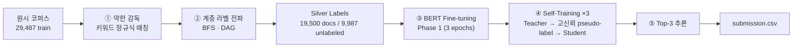
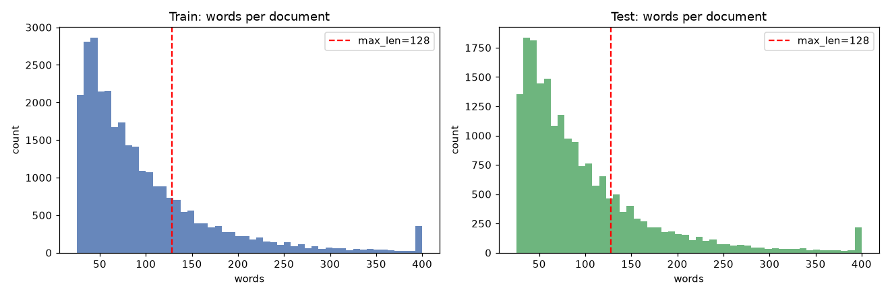
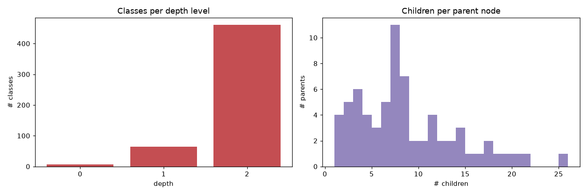
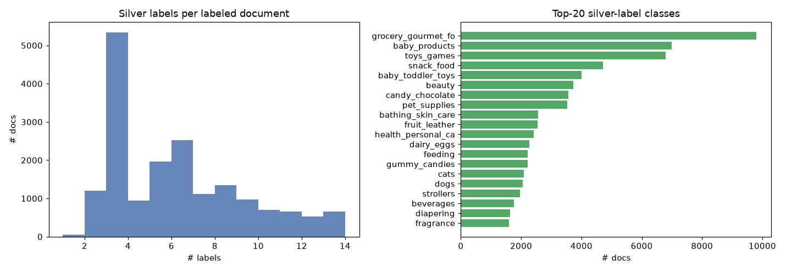
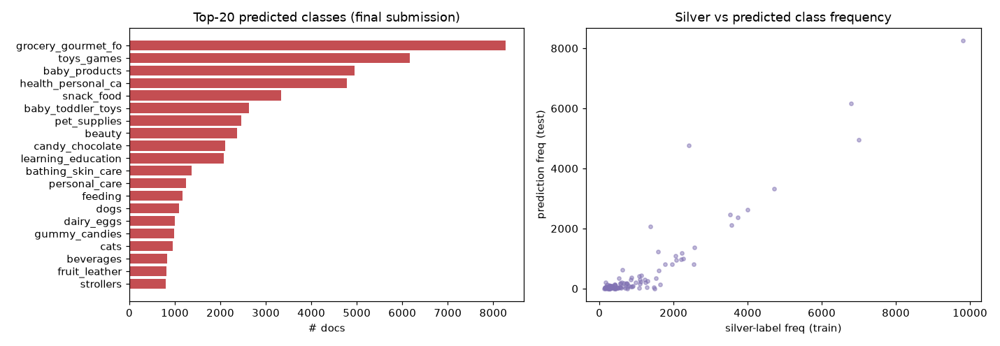

# Amazon 상품 카테고리 다중 라벨 분류 (Multi-Label Text Classification)

> 라벨이 없는 Amazon 상품 리뷰 텍스트를 **531개 계층형 카테고리**로 분류하는 프로젝트.
> 정답 라벨이 거의 없는 상황을 **약한 감독학습(Weak Supervision)** 과 **자가 훈련(Self-Training)** 으로 돌파했습니다.

| 항목 | 내용 |
|---|---|
| **프로젝트** | Amazon 상품 카테고리 다중 라벨 분류 (531개 클래스, 계층형/DAG) |
| **핵심 기술** | BERT Fine-tuning + 약한 감독학습(Weak Supervision) + 자가 훈련(Self-Training) |
| **사용 라이브러리** | PyTorch, HuggingFace Transformers, scikit-learn, NumPy, Pandas, Matplotlib |
| **데이터** | 학습 29,487 문서 / 테스트 19,658 문서 / 531 클래스 |
| **과제 형식** | Kaggle 스타일 리더보드 제출 (top-3 예측) |

---

## 1. 문제 (Problem)

Amazon 상품 리뷰/설명 텍스트가 주어졌을 때, 그 상품이 속하는 **카테고리를 자동으로 예측**해야 합니다.
카테고리는 `grocery_gourmet_food → meat_poultry → jerky` 처럼 **계층 구조**를 이루며, 한 상품이 **여러 카테고리에 동시에**
속할 수 있습니다(multi-label). 테스트셋 19,658개 문서 각각에 대해 가장 그럴듯한 **상위 3개 카테고리**를 제출합니다.

가장 큰 난점: **사람이 단 정답(gold label)이 사실상 없습니다.** 학습 코퍼스는 텍스트만 주어지고, 정답은 채점 서버(교수님)만
보유합니다. 즉 *지도학습을 그대로 적용할 수 없는* 환경입니다.

## 2. 문제 정의 (Problem Definition)

위 문제를 머신러닝 과제로 다음과 같이 정형화했습니다.

- **입력** `x` : 상품 리뷰 텍스트 (영어, 평균 ~98 단어)
- **출력** `y ∈ {0,1}^531` : 531차원 멀티-핫 벡터 (다중 라벨)
- **목표** : top-3 카테고리 예측 품질 극대화
- **제약 조건**
  1. **라벨 부재** → 지도학습 불가. 라벨을 *스스로 만들어야* 함.
  2. **계층/DAG 구조** → 자식 카테고리가 맞으면 그 부모도 맞음 (라벨 전파 필요). 일부 클래스는 부모가 여럿(DAG).
  3. **다중 라벨** → 단일 softmax가 아니라 클래스별 독립 확률(sigmoid) 필요.
  4. **클래스 불균형(long-tail)** → 531개 중 다수 클래스는 신호가 매우 희소.

→ 핵심 질문: **"정답이 없는데 어떻게 학습 신호를 만들고, 그 신호를 어떻게 확장할 것인가?"**

## 3. 문제 해결에 쓰인 이론적 배경 (Theory)

| 이론 | 역할 | 적용 위치 |
|---|---|---|
| **Distant / Weak Supervision** | 클래스별 키워드 사전을 정규식(`\b`)으로 매칭해 *noisy한 silver label* 생성 | `pipeline.ipynb` Phase 0 |
| **Hierarchical Label Propagation** | 매칭된 자식 클래스 → BFS로 모든 조상(부모) 라벨 전파 (DAG 대응) | `generate_silver_labels_strict` |
| **Transfer Learning (BERT)** | 사전학습된 `bert-base-uncased`를 백본으로 fine-tuning → 적은 신호로도 문맥 이해 | `TaxoClassModel` |
| **Multi-label Classification** | `Linear(768→531)` + `BCEWithLogitsLoss`(클래스별 sigmoid) → 다중 라벨 출력 | 모델 헤드 / 손실 |
| **Self-Training (Semi-supervised)** | Teacher 모델이 unlabeled 데이터에 pseudo-label 생성 → 고신뢰(≥0.8) 샘플만 선별해 재학습 | Phase 2 (3회 반복) |
| **Confidence Thresholding** | top-3 평균 확률 ≥ 0.8 인 샘플만 채택 → *Confirmation Bias* 억제 | pseudo-label 필터 |

> 한 줄 요약: **약한 라벨로 씨앗(seed)을 만들고 → 계층으로 라벨을 넓히고 → BERT로 문맥을 학습한 뒤 → self-training으로 라벨 없는 데이터까지 끌어들여 점진적으로 정제**합니다.

## 4. 프로그래밍으로 구현한 과정 (Implementation)



1. **약한 라벨 생성** — 531개 클래스의 키워드를 미리 컴파일한 정규식(`\b(kw1|kw2|...)\b`)으로 매칭.
   `apple`이 `pineapple`에 걸리는 false positive를 단어 경계(`\b`)로 차단.
2. **계층 전파** — 매칭된 클래스에서 BFS로 모든 부모를 추가(멀티-핫 벡터 완성). DAG(다중 부모)도 처리.
3. **초기 학습(Phase 1)** — silver label로 BERT를 3 epoch fine-tuning, `BCEWithLogitsLoss`.
4. **자가 훈련(Phase 2 ×3)** — 학습된 모델이 unlabeled + test 문서에 pseudo-label 생성 →
   top-3 평균 확률 ≥ 0.8 인 것만 hard-label로 추가 → 재학습. (라벨 +582 → +6,071 → +8,626 으로 확장)
5. **추론 & 제출** — 각 테스트 문서에 대해 sigmoid 확률 top-3을 `submission.csv`로 저장.

전체 코드는 [`pipeline.ipynb`](pipeline.ipynb) 한 파일에 모듈식 함수로 구현되어 있습니다.

---

## 5. 데이터 분석 & 결과 (EDA)

> 재현 노트북: [`eda.ipynb`](eda.ipynb) — 아래 수치와 그래프는 실제 실행 결과입니다.
> 약한 라벨 재현 시 파이프라인 로그의 **19,500 / 9,987 split이 정확히 일치**함을 확인했습니다(재현성 검증).

### 5.1 문서 길이 — `max_len=128` 선택 검증


- 단어 수: 학습 평균 **98.4** / 중앙값 **74** / 최대 **1,708**
- **22.4%의 문서가 128단어를 초과** → `max_len=128`은 약 1/5 문서의 뒷부분을 잘라냅니다. (개선 후보)

### 5.2 클래스 계층(taxonomy) 구조


- 루트 **6개**, 리프 **462개**, 최대 깊이 **2**(3단계), 부모당 평균 자식 **8.2개**
- **25개 클래스가 다중 부모** (최대 7개) → 트리가 아니라 **DAG** → 단순 트리 가정이 아닌 BFS 전파가 필요

### 5.3 약한 감독 커버리지


- 약한 라벨이 학습셋의 **66.1%**(19,500/29,487)만 덮음, 문서당 평균 **6.77개** 라벨
- **531개 중 277개 클래스에만** 신호 존재 → 나머지 ~48% 클래스는 약한 라벨 0개 (**self-training 도입의 직접적 동기**)

### 5.4 최종 제출 결과 분석


- 문서당 **3.0개** 라벨(top-3), 그러나 **531개 중 108개 클래스에만** 예측이 집중(423개 미사용)
- 우측 산점도: **예측 빈도 ↔ silver-label 빈도가 강한 양의 상관** → 모델이 head 클래스로 쏠리고 tail을 놓치는 **long-tail 편향**을 정량 확인

## 6. 평가 프로토콜 & 결과 (Evaluation)

테스트 정답이 비공개라 파이프라인에는 정량 평가가 없었습니다. 이 공백을 메우기 위해
[`evaluation.ipynb`](evaluation.ipynb)에 **재현 가능한 hold-out 평가**를 추가했습니다.
약한 라벨 데이터를 `train`/`validation`(15%)으로 분리해, 학습 후 검증셋에서 측정합니다.

> ⚠️ **정직한 한계**: 검증 라벨도 *약한 라벨*이라, 이 점수는 "사람 정답 대비 정확도"가 아니라
> **"모델이 약한 감독 패턴을 얼마나 잘 일반화하는가"** 를 측정합니다. (아래는 GPU에서 실측한 값)

| 지표 | 점수 | 해석 |
|---|---|---|
| **Micro-F1** | 0.558 | 다수(head) 클래스 포함 전반 성능 |
| **Macro-F1** | **0.046** | 클래스별 F1 평균 → **long-tail 문제를 정량 확인** (EDA의 108/531 쏠림과 일치) |
| **Micro-Precision** | 0.962 | 예측한 라벨의 96%가 맞음 → 매우 보수적·정밀 |
| **Micro-Recall** | 0.393 | 실제 라벨의 39%만 포착 → 적게 예측 |
| **P@3** | 0.765 | top-3 예측 중 76%가 정답 (제출 전략과 직결) |
| **R@3** | 0.434 | top-3가 정답의 43%를 커버 |

**해석.**
- **높은 Precision(0.96) + 낮은 Recall(0.39)** → 확신하는 소수만 예측하는 **보수적** 모델.
- **Micro-F1(0.56) ≫ Macro-F1(0.046)** → 소수 head 클래스는 잘 맞히지만 다수 tail 클래스는 거의 못 맞힘.
  EDA에서 본 **클래스 쏠림(108/531)** 이 지표로 그대로 재현됨 → 이 프로젝트의 **핵심 개선 포인트**.
- **R@3(0.43)** 가 낮은 이유: 문서당 평균 silver label이 **6.77개**인데 제출은 top-3뿐이라
  recall이 구조적으로 상한에 걸림(정답 라벨 수 > 3).

> GPU 권장. CPU에서는 `CONFIG['subset']`을 작게 설정해 스모크 테스트.

## 7. 한계 & 개선 방향 (Limitations & Future Work)

| # | 한계 (근거) | 개선 방향 |
|---|---|---|
| 1 | **정량 평가 부재** — 테스트 정답 비공개 + 모델 체크포인트 미저장 | `evaluation.ipynb`의 hold-out F1 프로토콜, `torch.save` 체크포인트화 |
| 2 | **Long-tail** — 클래스 절반이 약한 라벨 0개, 예측은 108/531 클래스에 집중 (**Macro-F1 0.046으로 실측 확인**) | 키워드 사전 보강(254개 미커버 클래스), class-weighted/focal loss, tail 오버샘플링 |
| 3 | **낮은 Recall** — Precision 0.96 vs Recall 0.39 (보수적 예측) | 판정 임계값 하향, 라벨 수 동적 결정 |
| 4 | **입력 truncation** — 22% 문서가 128단어 초과로 잘림 | `max_len` 상향 또는 long-context 인코더(Longformer 등) |
| 5 | **인코더 단일** — `bert-base`만 사용 | RoBERTa/DeBERTa 등으로 교체·비교 (평가 노트북으로 정량 비교 가능) |
| 6 | **재현성 문서화 부족** | `requirements.txt` 추가 완료, 시드 고정 |

## 8. 저장소 구조

```
.
├── README.md                 # 본 문서
├── requirements.txt          # 의존성
├── pipeline.ipynb            # 메인 파이프라인 (Weak Supervision → BERT → Self-Training → 제출)
├── eda.ipynb                 # 데이터/결과 정량 분석 (실행 출력 포함)
├── evaluation.ipynb          # Hold-out F1 평가 프로토콜 (GPU 권장)
├── dummy_baseline.ipynb      # 랜덤 예측 베이스라인
├── submission_finals.csv     # 최종 제출 결과
├── figures/                  # eda.ipynb가 생성한 그래프 (README에서 참조)
└── Amazon_products/
    ├── classes.txt               # 531개 클래스 정의
    ├── class_hierarchy.txt       # 부모-자식 계층 (DAG)
    ├── class_related_keywords.txt# 클래스별 키워드 사전 (약한 감독용)
    ├── train/train_corpus.txt    # 학습 코퍼스 (29,487)
    └── test/test_corpus.txt      # 테스트 코퍼스 (19,658)
```

## 9. 실행 방법

```bash
pip install -r requirements.txt

# 1) 데이터/결과 분석 (CPU 가능, 수 분 소요)
jupyter notebook eda.ipynb

# 2) 전체 파이프라인 재학습 & 제출 생성 (GPU 권장)
jupyter notebook pipeline.ipynb

# 3) 정량 평가 (GPU 권장)
jupyter notebook evaluation.ipynb
```

## 기술 스택

`Python` · `PyTorch` · `HuggingFace Transformers (BERT)` · `scikit-learn` · `NumPy` · `Pandas` · `Matplotlib`

**핵심 ML 개념**: Weak/Distant Supervision · Hierarchical Label Propagation · Transfer Learning ·
Multi-label Classification (BCE) · Self-Training (Semi-supervised) · Confidence Thresholding
